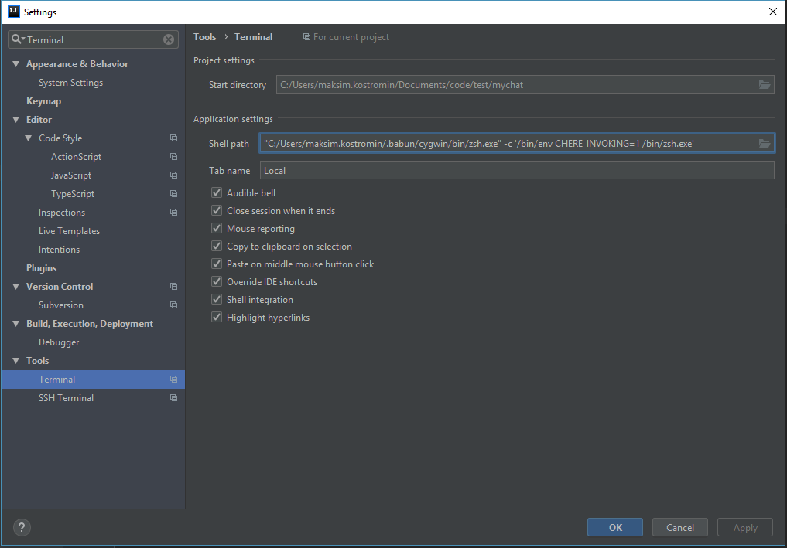

# .babun-shell
Best shell for windows ever (zsh)

## IntelliJ IDEA

1. [install babun shel from home site]()
2. fix fons in idea console
   ```
   echo "TERM=cygwin" >> ~/.zshrc
   ```
3. add idea integration: `"C:/Users/maksim.kostromin/.babun/cygwin/bin/zsh.exe" -c '/bin/env CHERE_INVOKING=1 /bin/zsh.exe'`


<!--
Format: 
Format: 
-->

## ConEmu

Open ConEmu -> Settings -> Startup -> Tasks
Create a new task with

- parameters: `/icon "%userprofile%\.babun\cygwin\bin\mintty.exe" /dir "%userprofile%"`
- commands: `%userprofile%\.babun\cygwin\bin\mintty.exe /bin/env CHERE_INVOKING=1 /bin/zsh.exe`

in my case it was like so:


finnaly, set babun as default one:


read 
